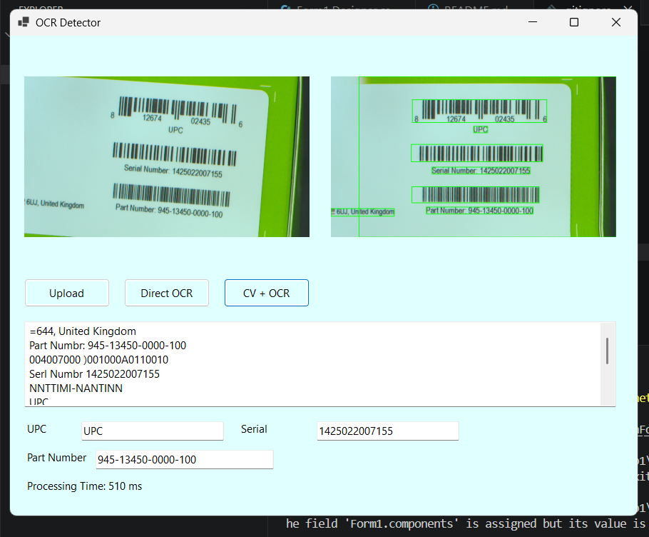
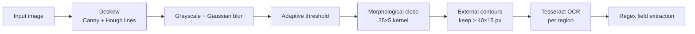

# Jetson Nano Box Label Reader

A Windows desktop app that reads the **serial number** and **part number** printed under the barcodes on NVIDIA Jetson Nano packaging. It combines OpenCV image processing with Tesseract OCR, and was designed to cope with rotated, blurred and zoomed-out photos of the box label.



## Problem

Product boxes carry their identifiers as barcodes with human-readable text underneath. Typing these numbers by hand during inventory or receiving is slow and error-prone, and photos taken quickly are often rotated, blurred or taken from too far away.

## Features

- Load a photo of the box label
- Two processing modes for comparison:
  - **Direct OCR:** Tesseract on the whole image
  - **CV + OCR:** deskew the image, locate text and barcode regions, then OCR each region separately
- Draws a box around every detected region
- Extracts the **serial number** (13–15 digits) and **part number** (pattern `NNN-NNNNN-NNNN-NNN`) into separate fields
- Detects the "UPC" label
- Shows processing time for each run

## How the CV + OCR pipeline works



1. **Deskew:** the strongest Hough line gives the label's angle, and the image is rotated to straighten it.
2. **Region detection:** adaptive thresholding and a wide, flat morphological closing merge characters and barcode bars into blocks, which are found as contours.
3. **OCR:** each region is cropped and read with Tesseract using the custom `hmn2` model in `tessdata/`.
4. **Field extraction:** regular expressions pick out the serial and part numbers from the combined text.

## Results

Screenshots of real runs are in [`screenshots/`](screenshots):

| Case | Serial | Part number | Time |
| --- | --- | --- | --- |
| [Close-up](screenshots/detected_box.png) | ✅ | ✅ | 510 ms |
| [Rotated label](screenshots/rotate_image.png) | ✅ | ✅ | 267 ms |
| [Blurred image](screenshots/Blur_image.png) | ✅ | ✅ | 277 ms |
| [Zoomed out (small label)](screenshots/failstate.png) | extracted, not verified | ❌ | 567 ms |

These are individual examples, not an accuracy benchmark.

## Tech stack

- C# / .NET 8, Windows Forms
- [OpenCvSharp4](https://github.com/shimat/opencvsharp) for image processing
- [Tesseract](https://github.com/charlesw/tesseract) 5.2 .NET wrapper with custom trained data

## Project structure

```
Barcode-Detection-System/
├── WinFormsApp1.sln
├── WinFormsApp1/
│   ├── Form1.cs            # Image loading, OCR modes, CV pipeline, field extraction
│   ├── Form1.Designer.cs   # UI layout
│   ├── Program.cs
│   ├── WinFormsApp1.csproj
│   └── tessdata/           # Tesseract models: eng, hmn, hmn2 (used)
└── screenshots/
```

## Getting started

Requirements: Windows, [.NET 8 SDK](https://dotnet.microsoft.com/download/dotnet/8.0) (or Visual Studio 2022).

```bash
git clone https://github.com/NoeNoe25/Barcode-Detection-System.git
cd Barcode-Detection-System
dotnet run --project WinFormsApp1
```

Click **Upload** to choose an image, then **Direct OCR** or **CV + OCR**.

## Limitations

- The app reads the printed text, not the barcode bars, so the UPC field only shows that a UPC label was found, not its number.
- Small or distant labels lose detail, and the part number is often missed.
- Deskewing uses a single Hough line, so strong edges from the box itself can produce the wrong angle.
- Works on still images only. There is no camera input.

## Future improvements

- Decode the barcodes directly (for example with ZXing.Net) and cross-check them against the OCR text
- Upscale small regions before OCR
- Add live camera capture
- Evaluate on a labelled set of box photos and report accuracy

## Author

**Hsu Myat Noe** · Robotics & AI Engineering, KMITL · [GitHub](https://github.com/NoeNoe25) · [LinkedIn](https://www.linkedin.com/in/hsu-myat-noe569aa729a/)

## License

[MIT](LICENSE)
